# Bayesian Data Analysis Project Report

Yangzhe Kong, Ziqing Du

---

## Dataset: mtcars

The data was extracted from the 1974 Motor Trend US magazine, and comprises fuel consumption and 10 aspects of automobile design and performance for 32 automobiles (1973–74 models). 

--- 

- Miles per gallon  (a measure of fuel consumption)
- Number of cylinders
- Displacement (the total volume of the cylinders)
- Gross horsepower
- Rear axle ratio (related to towing capabilities)
- Weight
- Quarter mile time (how fast the car can traverse a quarter mile)
- Shape of the engine - straight vs V-shaped
- Transmission  - automatic vs manual
- Number of forward gears
- Number of carburetors

---

## Data Exploration
First convert to metric units 
- fuel consumption: From Miles per US gallon to Litres per 100 km 
- Weight: From pound to ton 
- Displacement: From inch to litre   
Then normalize all data into the range $[0,1]$ except for engine type and transmission type
as they are already in the range $[0,1]$

---

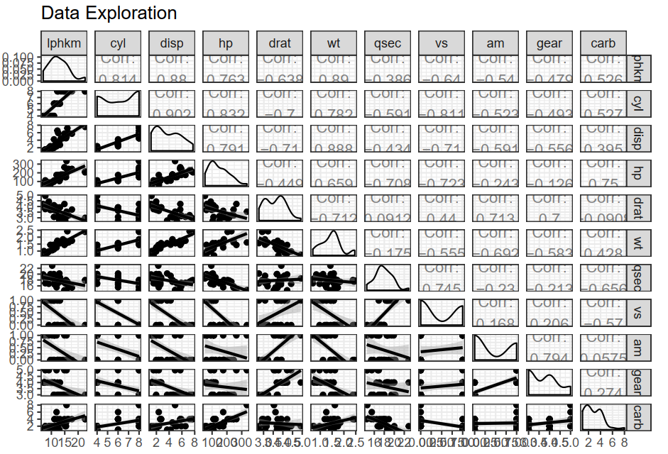

---
## Model Formulation  

Since there’s no clear need for non-linearity as stated above, we can use bayesian linear regression, i.e.,
$$y ∼ N(α + βX, σ²)$$

where y is 1/4 mile time, X is the matrix of predictor variables and α, β are the intercept and regression coefficients, respectively  

---

**Weakly informative priors**
- The rule of thumb for weakly informative distributions is that the standard deviation of the posterior distribution should be less than 0.1 times that of the prior.  
alpha ~ cauchy(0,10);
beta ~ student_t(3,0,2);
sigma ~ normal(0,10);

---

Analysis Problem: What are the best variables that can be used to predict car performance? 

- Variables:
For multivariate model 1, horsepower, number of carburetors, car weight, transmission type and shape of the engine are the variables X. 
For multivariate model 2, displacement, car weight, shape of the engine, number of carburetors would be used as variables X. 
And for multivariate model 3, all variables will be used.  

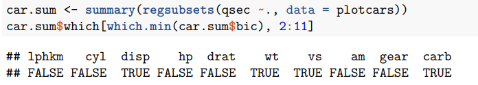

---

```R
Separate linear modeling
stan_separate_model = '
data {
int<lower=0> N;
vector[N] x;
vector[N] y;
}
parameters {
real alpha;
real beta;
real<lower=0> sigma;
}
transformed parameters{
vector[N] mu;
mu = alpha + beta*x;
}
model {
alpha ~ cauchy(0,10);
beta ~ student_t(3,0,2);
sigma ~ normal(0, 10);
y ~ normal(mu, sigma);
}
// Log likelihoods genereated for LOO
generated quantities {
vector[N] log_lik;
for (i in 1:N)
log_lik[i] = normal_lpdf(y[i] |alpha+x[i]*beta , sigma);
}'  

```

```R
stan_nlin_model1 = '
data {
int<lower=0> n;
vector[n] hp;
vector[n] wt;
vector[n] vs;
vector[n] am;
vector[n] carb;
vector[n] qsec;
}
parameters {
real alpha;
real beta_hp;
real beta_wt;
real beta_vs;
real beta_am;
real beta_carb;
real<lower=0> sigma;
}
transformed parameters{
vector[n] mu;
mu = alpha + beta_hp*hp + beta_wt*wt + beta_vs*vs +
beta_am*am + beta_carb*carb;
}

```
---

```R
model {
alpha ~ cauchy(0,10);
beta_wt ~ student_t(3,0,2);
beta_hp ~ student_t(3,0,2);
beta_am ~ student_t(3,0,2);
beta_vs ~ student_t(3,0,2);
beta_carb ~ student_t(3,0,2);
sigma ~ normal(0, 10);
qsec ~ normal(mu, sigma);
}
// Log likelihoods genereated for LOO
generated quantities {
vector[n] log_lik;
for (i in 1:n)
log_lik[i] = normal_lpdf(qsec[i] |mu[i] , sigma);
}'  


```

```R
stan_nlin_model2 = '
data {
int<lower=0> n;
vector[n] disp;
vector[n] wt;
vector[n] vs;
vector[n] carb;
vector[n] qsec;}
parameters {
real alpha;
real beta_disp;
real beta_wt;
real beta_vs;
real beta_carb;
real<lower=0> sigma;}
transformed parameters{
vector[n] mu;
mu = alpha + beta_disp*disp + beta_wt*wt +beta_vs*vs + beta_carb*carb;}
model {
alpha ~ cauchy(0,10);
beta_disp ~ student_t(3,0,2);
beta_wt ~ student_t(3,0,2);
beta_vs ~ student_t(3,0,2);
beta_carb ~ student_t(3,0,2);
sigma ~ normal(0, 10);
qsec ~ normal(mu, sigma);
}

```

---

```R

// Log likelihoods genereated for LOO
generated quantities {
vector[n] log_lik;
for (i in 1:n)
log_lik[i] = normal_lpdf(qsec[i] |mu[i] , sigma);
}'  
stan_nlin_model3 = '
data {
int<lower=0> n;
vector[n] lphkm;
vector[n] cyl;
vector[n] disp;
vector[n] hp;
vector[n] drat;
vector[n] wt;
vector[n] vs;
vector[n] am;
vector[n] gear;
vector[n] carb;
vector[n] qsec;}
parameters {
real alpha;
real beta_lphkm;
real beta_cyl;
real beta_disp;
real beta_hp;
real beta_drat;
```

```R

real beta_wt;
real beta_vs;
real beta_am;
real beta_gear;
real beta_carb;
real<lower=0> sigma;}  
transformed parameters{
vector[n] mu;
mu = alpha + beta_lphkm*lphkm + beta_cyl* cyl + beta_disp * disp + beta_hp*hp + beta_drat* drat + beta}
model {
alpha ~ cauchy(0,10);
beta_lphkm ~ student_t(3,0,2);
beta_cyl ~ student_t(3,0,2);
beta_hp ~ student_t(3,0,2);
beta_drat ~ student_t(3,0,2);
beta_wt ~ student_t(3,0,2);
beta_am ~ student_t(3,0,2);
beta_vs ~ student_t(3,0,2);
beta_gear ~ student_t(3,0,2);
beta_carb ~ student_t(3,0,2);
sigma ~ normal(0, 10);
qsec ~ normal(mu, sigma);}
// Log likelihoods genereated for LOO
generated quantities {
vector[n] log_lik;
for (i in 1:n)
log_lik[i] = normal_lpdf(qsec[i] |mu[i] , sigma);}'

```

---

## Convergence diagnostics - Rhat values / ESS
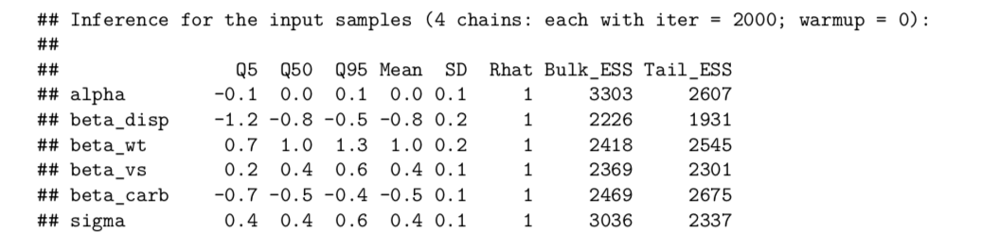

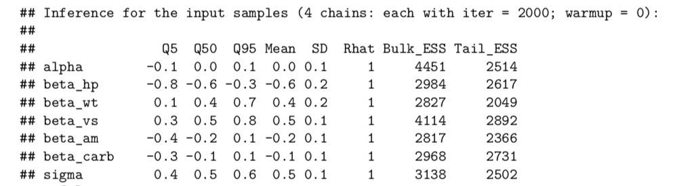


---

## LOO-cv

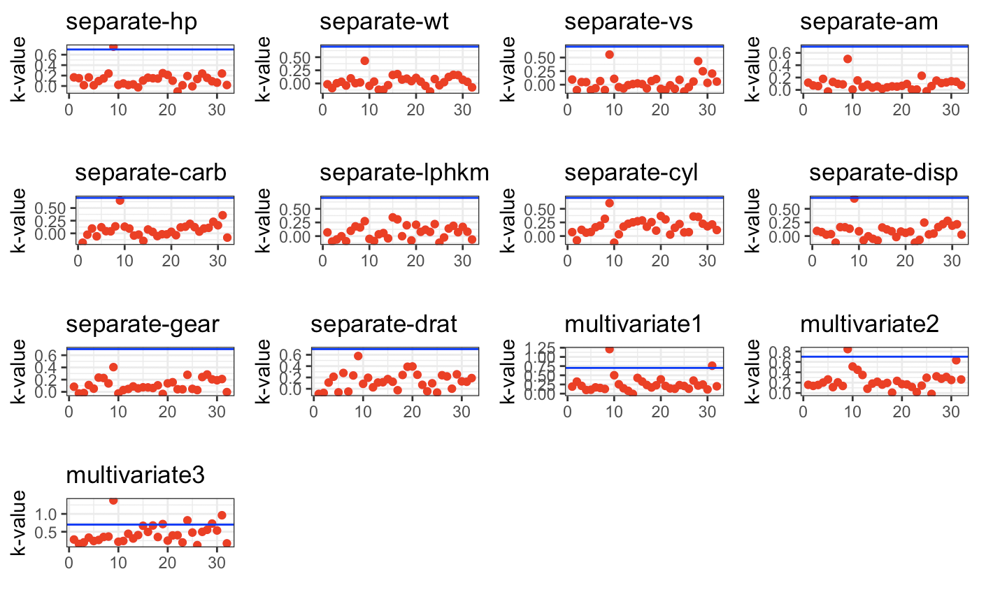

---

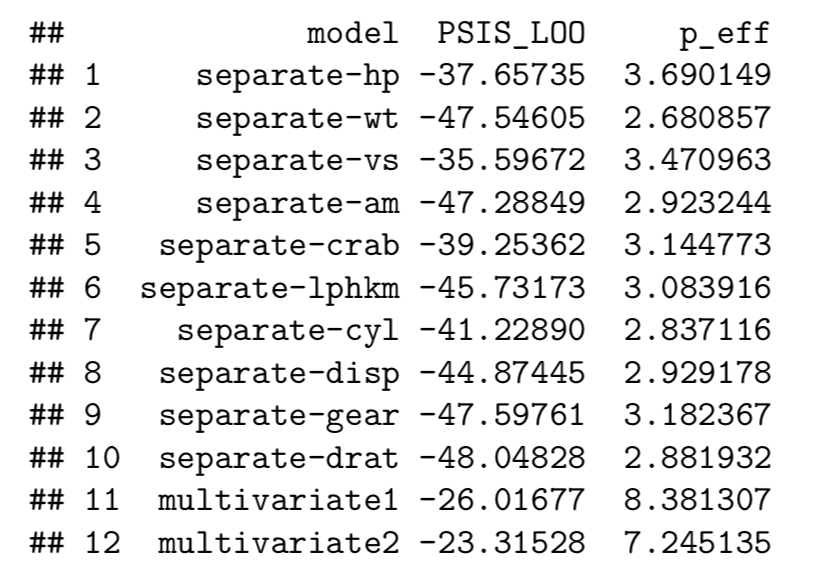

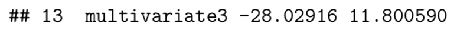

---

## Posterior Distributions  

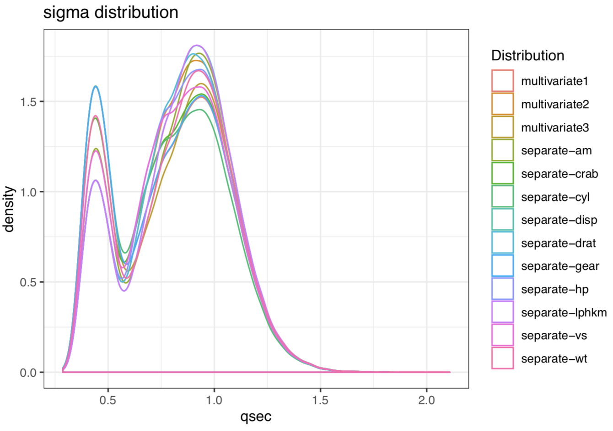

---

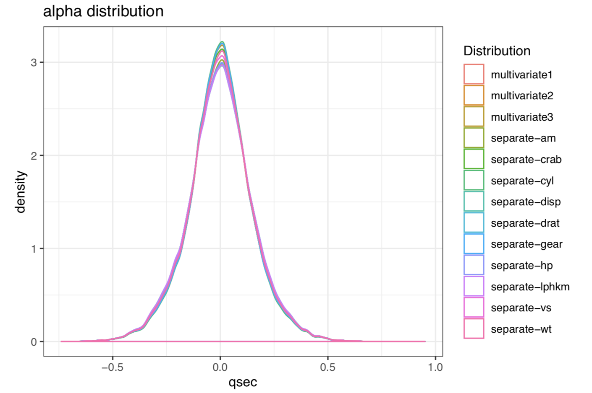

---


---

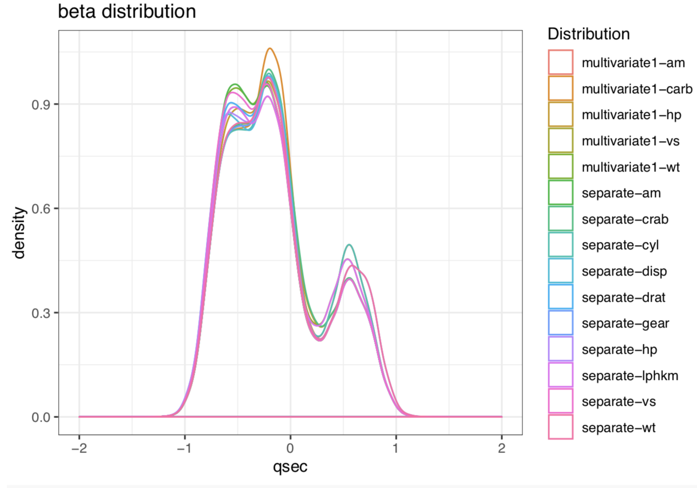

---

## Quarter mile time predictive distributions  

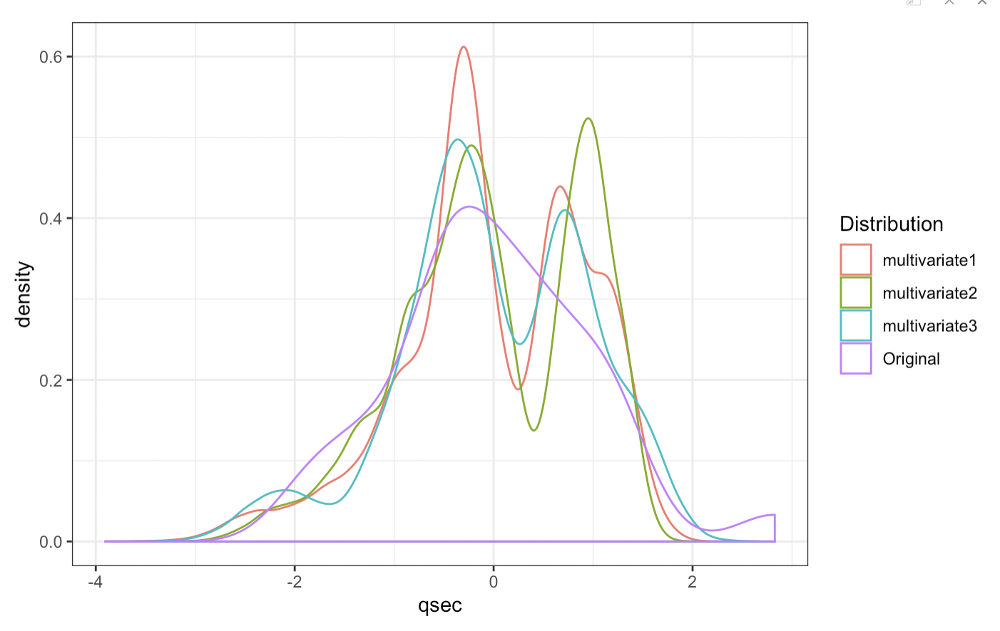

---

## Residuals

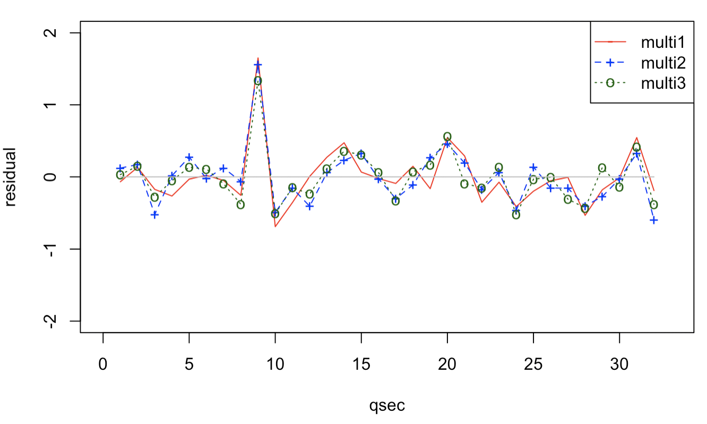

---


---

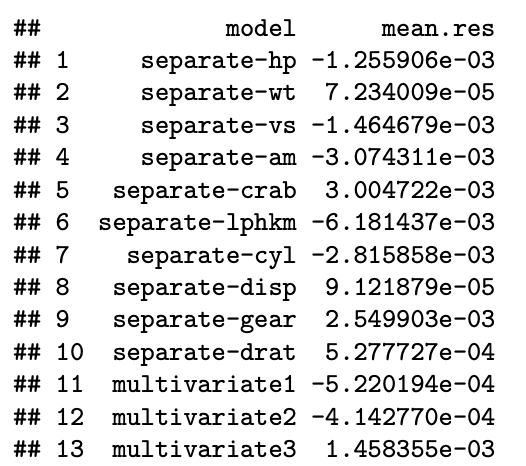

---

## Statistics Inference 

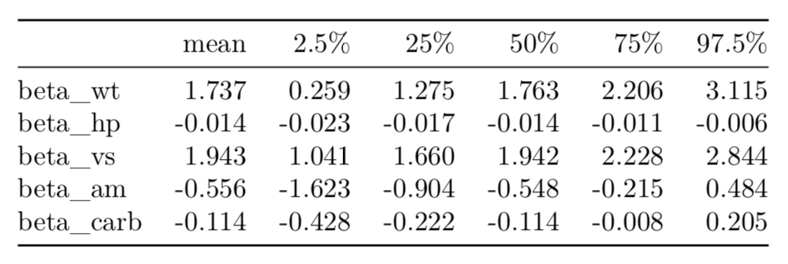

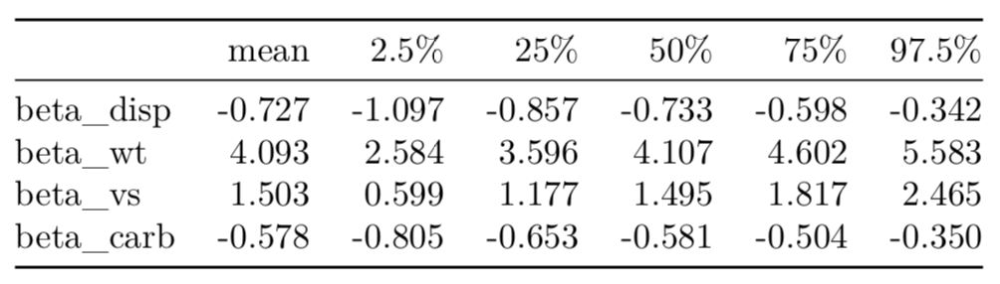

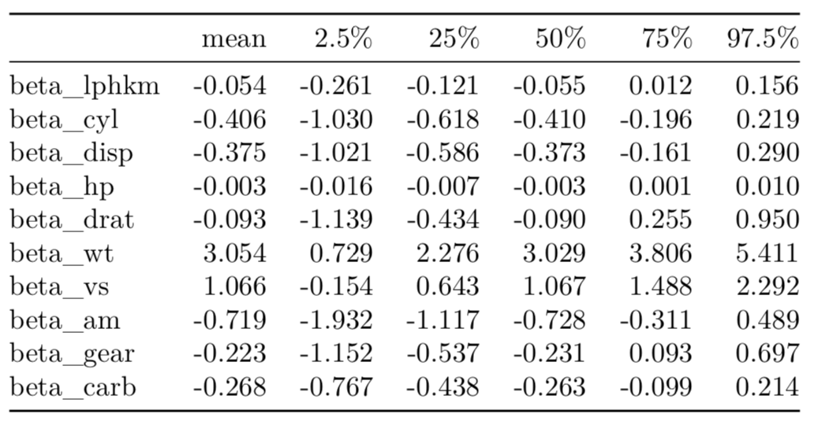

---

## Sensitive Analysis

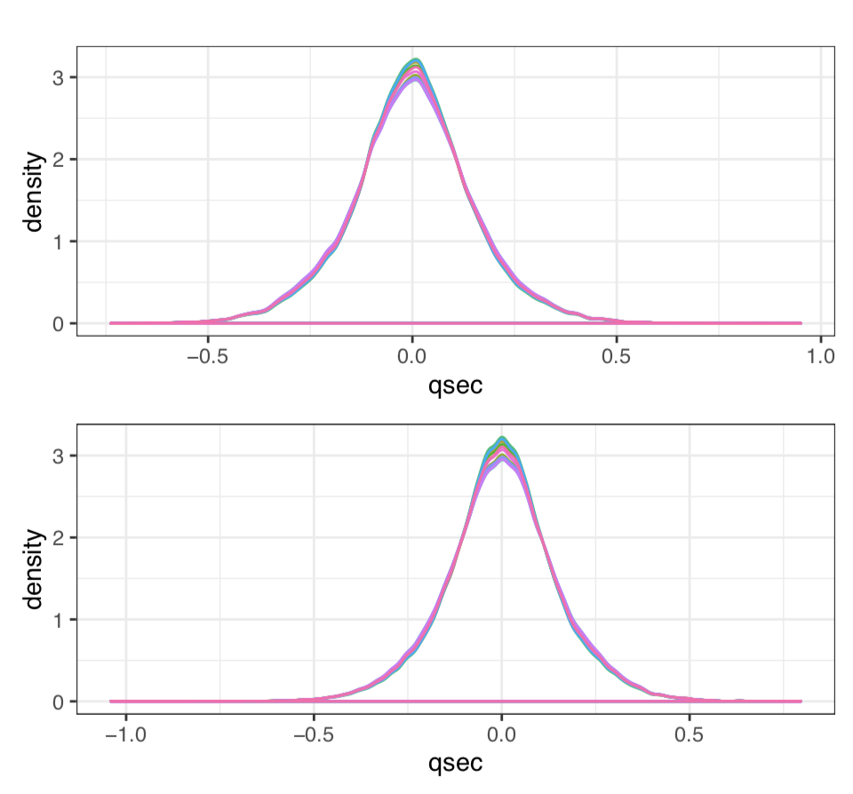

---


---

## Conclusions

Target: the performance of the car. 
Method: Parameter selection
Models: three multivariate models

The shape of the engine(straight vs V-shaped) and the weight parameter give much more support for cars traversing a quarter mile. 

---

## Acknowledges
					
Our main inspiration to explore linear regression model using mtcars dataset stemmed from [1]
					
					
[1] Anton Mattsson, bdacars, (2018), GitHub repository, https://github.com/antonvsdata/bdacars  
[2] stan-dev, (2019), Prior Choice Recommendations, GitHub repository, https://github.com/stan-dev/stan/wiki/Prior-Choice-Recommendations  

---

## Thank you for your time!

[complete sildes](https://docs.google.com/presentation/d/1VSKVRpWQ_tz7Gm_Zfj-_EpXvKwN-yLGmcZHwgClbbac/edit?usp=sharing)
[complete report](https://github.com/Yanko96/CS-E5710-Bayesian-Data-Analysis/blob/master/Project/project.pdf)
