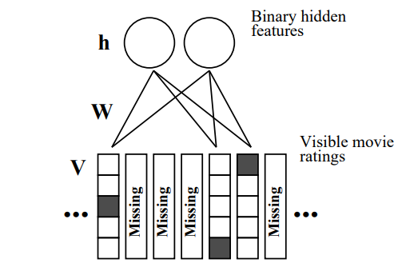

# Deep Bolzmann Machine

Yangzhe Kong

---

## Boltzmann Machines

- Network is symmetrically connected 
- Allow connection between visible and hidden units 
- Each binary unit makes stochastic decision to be either on or off 

---

- The configuration of the network dictates its “energy”
- At the equilibrium state, the likelihood is defined as the exponentiated negative energy, known as the Boltzmann distribution

- The joint probability of the variable 𝑋 is derived by Boltzmann Distribution as follows, Where Z is the Partition Function. 
$$p(\mathbf{x}=\frac{1}{Z} exp(\frac{-E(\mathbf{x})}{T}))$$

---

- Energy Function is defined as
- $$E(\mathbf{x})\overset{\Delta}{=}E(\mathbf{X}=\mathbf{x})=-(\sum_{i<j} w_{ij}x_ix_j+\sum_{i}b_ix_i)$$
    where $𝑤_𝑖𝑗$s are connection weights, $x_i\in\{0,1\}$ expresses the state of the variable and $𝑏_𝑖$ is the bias of variable $x_i$

---

- Two problems: 
1. Given $w_{ij}$s and biases, how to achieve thermal equilibrium of $P(\mathbf{X})$ over all possible network config
2. Given $\mathbf{X}$, learn $w_{ij}$s and biases to maximize $P(\mathbf{X})$

---

Problem 1: How to achieve equilibrium
- We can use Gibbs Sampling
- The conditional probability of the variable $x$ can be derived as follows

$$
p(x_i=1|\mathbf{X}_{\backslash i} )=\sigma(\frac{\sum_j(w_{ij} x_i+b_i)}{T})
$$



$$
p(x_i=0│\mathbf{X}_{\backslash i} )=1−p(x_i=0│\mathbf{X}_{\backslash i} )
$$


---

- The speed of convergence is related to the temperature 𝑇.

When $T→\infty,  p(x_i=1│\mathbf{x}_(\backslash i) )→0.5$.  
When $𝑇→0$,   

$$
if \Delta E_i(\mathbf{X}_(\backslash i) )>0,  p(x_i=1│\mathbf{X}_(\backslash i) )→1
$$



$$
if \Delta E_i(\mathbf{X}_(\backslash i) )<0,  p(x_i=1│\mathbf{X}_(\backslash i) ) →0
$$


- It means that when $𝑇→0$, the whole system change from being dynamic to deterministic.

---

- We can use Simulated Annealing Algorithm to introduce some randomness to jump out from the local minimum by setting $x_i$ to 1 with a probability of 

$
\sigma((\Delta E_i (\mathbf{X}_(\backslash i) ))/T)
$

when 

$
\Delta E_i (\mathbf{X}_(\backslash i) )<0
$


---

Problem 2: how to learn the parameters
- Without loss of generalty, let us assume that variables in Boltzmann Machine consist of visible variables $𝐯∈{𝟎,𝟏}^𝒎$  and hidden variables $h\in{0,1}^n$. 
- Given a set of visible variables $\mathbf{D}={\mathbf{v} ̂^{((1) )},\mathbf{v} ̂^{((2) )},\cdots,\mathbf{v} ̂^{((𝑁) )} }$, our goal is to find the $𝑾$ that can maximize the log likelihood of the visible variables

$$
ℒ(𝒟│𝑊,b)=\frac{1}{𝑁} ∑_{(𝑛=1)^𝑁}log⁡(𝑝(𝐯 ̂^{((𝒏))} |𝑊,𝑏))
$$


---

- After some calculations, we can get the derivatives of $w_{ij}$  and $b_{i}$,  


$$
\frac{\nabla\mathcal{L}(\mathcal{D}│\mathbf{W},b)}{\nabla w_{ij}}=\lt x_ix_j \gt _{data}−\lt x_ix_j \gt _{model}
$$



$$
\frac{\nabla\mathcal{L}(\mathcal{D}│\mathbf{W},b)}{\nabla b_i}=\lt x_ix_j \gt _{data}−<\lt x_ix_j \gt _{model}
$$


- If gradient ascent is used, update rules can be written like this(update rule for biases is similar)         
                                                  

$$
w_{ij}\leftarrow w_{ij}+\alpha (\lt x_ix_j \gt _{data}− \lt x_ix_j \gt _{model})
$$


---

Positive Phase: 
- Clamp a data vector on the visible units and set the hidden units to random binary state.
- Update the hidden units one at a time until the network reaches thermal equilibrium at a temperature of 1.
- Sample $<x_ix_j>_{data}$ for every connected pair of units
- Repeat for all data vectors in the training set and average.

---

Negative Phase: 
- Set all the units to random binary states
- Update the units one at a time until the network reaches thermal equilibrium at a temperature of 1.
- Sample $<x_ix_j>_{model}$ for every connected pair of units
- Repeat many times and average to get good estimates

---

## Restricted Boltzmann Machines

- A simple **unsupervised** learning module;
- Only one layer of hidden units and one layer of visible units;
- No connection between hidden units nor between visible units;
- i.e. a special case of Boltzmann Machine;
- Edges are still undirected or bi-directional 

---

- e.g., an RBM with 2 visible and 3 hidden units: 

---

- Energy Function is defined as follows

$$
E(v,h)=−\sum_i a_iv_i−sum_i b_ih_i−\sum_i \sum_j v_iw_{ij}h_{j} \\ 
=−\mathbf{a}^T\mathbf{v}−\mathbf{b}^T\mathbf{h}−\mathbf{v}^TW\mathbf{h}
$$

- The joint probability $p(v,h)$ is defined as follows


$$
p(\mathbf{v},\mathbf{h}) =\frac{1}{Z} exp⁡(−E(\mathbf{v},\mathbf{h}))=\frac{1}{Z} exp⁡(\mathbf{a}^T\mathbf{v})exp⁡(\mathbf{b}^T\mathbf{h})exp⁡(\mathbf{v}^TW\mathbf{h})
$$


Where $Z=\sum_{\mathbf{v},\mathbf{h}} exp⁡(−E(\mathbf{v},\mathbf{h}))$ is the partition function

---

- Good property of RBM: No connection between hidden units nor between visible units; thus given visible variables, hidden variables are independent with each other, and vice versa. 

$$
p(v_i│\mathbf{V}_{\backslash i}, \mathbf{h})=p(v_i│\mathbf{h}); p(h_i│\mathbf{v},\mathbf{h}_{\backslash i})=p(v_i│\mathbf{v})
$$



$$
p(v_i=1│\mathbf{h})=σ(\sum_j w_{ij} h_i+a_i); p(ℎ_i=1│\mathbf{v})=\sigma(\sum_j w_{ij} v_i+b_i)
$$

- Still we have the same 2 problems as the Boltzmann Machines

---

Problem 1: How to reach equilibrium?
- Still we can use Gibbs Sampling

---

Sampling Procedure:
- (Given or) Randomly initiate a visible variable $\mathbf{v}_0$, calculate the probability distribution of hidden variable, and sample a hidden variable $\mathbf{h}_0$ from it.
- Based on $\mathbf{h}_0$, calculate the probability distribution of visible variable, and sample a hidden variable $\mathbf{v}_0$ from it.
- Iterate $t$ times and obtain $(\mathbf{v}_t,\mathbf{h}_t)$
- When $t→\infty$, $(\mathbf{v}_t,\mathbf{h}_t)$ obeys dirstribution of $p(\mathbf{v},\mathbf{h})$

---

Problem 2: How to learn the parameters?
- We can use a more efficient method called Contrastive Divergence (Hinton 2002) by exploiting the special structure of RBM. 
- Change the objective function from likelihood function to Contrastive Divergence
$$p^0||p_θ^\infty−p^1||p_θ^\infty$$

---

An approximate Maximum Likelihood Learning Algorithm
1. Pick a data vector, $\mathbf{d}$, from the distribution $p_0$.
2. Compute, for each expert separately, the posterior probability distribution over its latent (i.e., hidden) variables given the data vector, $\mathbf{d}$.
3. Pick a value for each latent variable from its posterior distribution.

---

4. Given the chosen values of all the latent variables, compute the conditional distribution over all the visible variables by multiplying together the conditional distributions specified by each expert and renormalizing.
5. Pick a value for each visible variable from the conditional distribution. These values constitute the reconstructed data vector, $\mathbf{d}^{reconstructed}$.

---

 <!--  -->

---
- A picture of contrastive divergence learning

---

- A good compromise between speed and correctness is to start with small weights and use CD1
1. Once the weights grow, the Markov chain mixes more slowly so we use CD3.
2. Once the weights have grow more we use CD10.

---

- Applications: Restricted Boltzmann Machines For Collaborative Filtering (Salakhudinov et al. 2007) 
- RBM can be used for Collaborative Filtering
- Wikipedia: In the newer, narrower sense, collaborative filtering is a method of making automatic predictions (filtering) about the interests of a user by collecting preferences or taste information from many users (collaborating). 

---

- Fundamental ideas: If two items get similar rating patterns then they are probably similar If two users rated items in a similar fashion, then they will probably give similar ratings to an unrated item Properties of items are unknown 

- Applications: Amazon (Customers Who Bought This Item Also Bought) Netflix Spotify

<!--  -->
---

- Make Visible Units K-nary

---
- Learning and Prediction are similar to normal RBM.

$$
\Delta W_{ij}^k = \epsilon (\lt v_i^k h_j \gt _{data} - \lt v_i^k h_j \gt _T)
$$



$$
\hat{p}_j = p(h_j = 1 | \mathbf{V}) = \sigma (b_j + \sum_{i=1}^m \sum_{k=1}^{K} v_i^k W_{ij}^k)
$$



$$
p(v_q^k=1| \hat{\mathbf{p}}) = \frac{exp(b^k + \sum_{j=1}^F \hat{p}_j W{qj}^k)}{\sum_{l=1}^K exp(b_p^l + \sum_{j=1}^F\hat{p}_j W{qj}^l)}
$$

- There are also some variations like RBM with Gaussian Hidden Units or Conditional RBM to choose.

---
## Deep Boltzmann Machines & Deep Belief Nets

- Deep Belief Network(DBN) have top two layers with undirected connections and lower layers have directed connections
- Deep Boltzmann Machine(DBM) have entirely undirected connections

<!--  -->

---

The wake-sleep algorithm: A learning algorithm for unsupervised neural networks (Hinton et al. 1995)
- Wake Phase: Use recognition weights to perform a bottom-up pass. Train the generative weights to reconstruct activities in each layer from the layer above
- Sleep Phase: Use generative weights to generate samples from the model. Train the recognition weights to reconstruct activities in each layer from the layer below

---

---

- An surprising observation: If we train an RBM, and use the output of the previous RBM as the input of the next RBM, and stack them together, what we get at last is not a multi-layer Boltzmann Machine, it’s actually a DBN!

---

This leads to an efficient way to train DBN (Hinton et al. 2006)
1. Training a deep network by stacking RBMs (adding another layer of features each time can improve the variational lower bound)
2. Fine-tuning with a contrastive version of the wake-sleep algorithm
- Do a stochastic bottom-up pass
- Do a few iterations of sampling in the top level RBM
- Do a stochastic top-down pass
3. Discriminative Fine-tuning (when training a discriminative model)

---

## Thank you for your time!

<!-- [complete sildes]() -->
