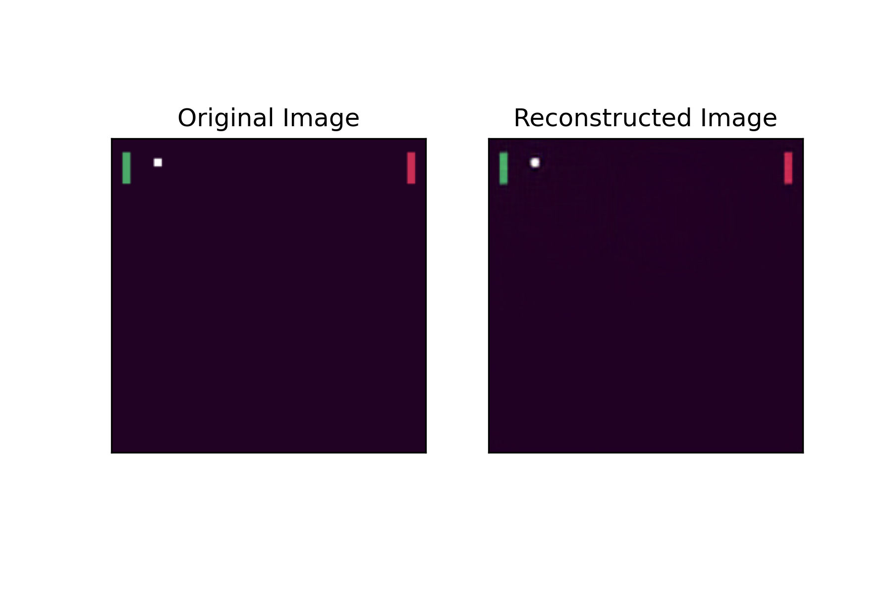

This project served as the final project of course 
ELEC-E8125--Reinforcement-learning D. The code is available [here](https://github.com/Yanko96/ELEC-E8125---Reinforcement-learning-D-Final-Project-Wimble-Pong)

Wimblepong is a two player version of the pong-v0 OpenAI Gym environment developed by Intelligent Robotics group at Aalto University, Finland.

## Motivation
In this project, we were asked to develop an agent for wimblepong and the agents will be tested in a battle royale. In addition, we have 2 options for state space: the visual observation or the encoded vector of the state. Altough many classmates chose to clone github repos of SOTA algorithms such as TRPO, PPO and Dueling Deep Q Networks, I decided to challenge myself and verify one of my questions: Will supervised pretained models help accelerate divergence of reinforcement learning agents? Therefore, I chose to use visual observations and first train a VAE to encode the visual observation, then train an A2C agent of which the input is the encoded state from the VAE encoder.

For sure A2C cannot be better than fancier algorithms, I'm still proud of myself, for bringing up ideas and verifying them independently. 

## Pretrained CNN-VAE
A CNN-VAE is pre-trained on collected observations of the wimblepong environment in order to accelerate the converge of the agent training. The VAE adopts a similar model strcture as ResNet. Some of the results on the test set are shown below.

## A2C Agent
The encoder of the Agent is loaded from the checkpoint of the encoder of the pre-trained CNN-VAE. Then the agent is trained by A2C algorithm with entropy loss to encourage exploration. With pre-trained VAE loaded as the encoder, the convergence of the agent is accelerated as the following figures show (green paddle is the agent).

## Conclusion
The pretrained encoder did help accelerate the convergence. However, there are several reasons why I don't recommend doing so:
1. There's a big gap between reconstructing the observations and predicting reliable actions and q-values. This makes pretrained model not completely plug-and-play for RL tasks. I spent many efforts selecting most suitable checkpoints and learning rates. It's not so worthwhile, especially considering that it only accelerate a relatively small amount of training time, but can hardly boost the performance.
2. The model structure of VAE is not necessarily the best for RL models. 
3. Exploration is the most crucial for RL. Not these tricks (that are not helpful for exploration).  

Anyways, it's still an interesting experience for me.