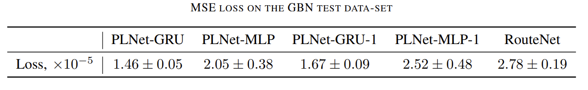
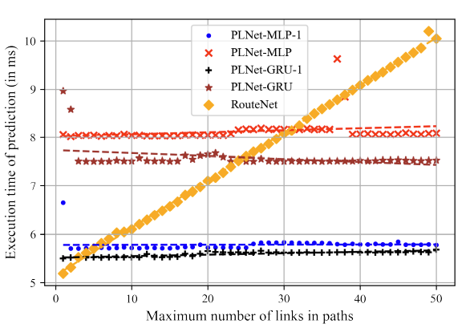

<!-- # Path-Link-Graph-Nerural-Network-for-IP-Performance-Prediction -->
The project was done in Nokia Bell Labs. The paper Path-Link Graph Neural Network for IP Network Performance Prediction is published in 2021 IFIP/IEEE International Symposium on Integrated Network Management (IM).

> Kong, Y., Petrov, D., Räisänen, V. and Ilin, A., 2021, May. <cite> Path-Link Graph Neural Network for IP Network Performance Prediction. In 2021 IFIP/IEEE International Symposium on Integrated Network Management (IM) (pp. 170-177). IEEE. </cite>

Paper [[PDF](https://dl.ifip.org/db/conf/im/im2021/211123.pdf)] 

## Motivation
Dynamic resource provisioning and quality assurance for the plethora of end-to-end slices running over 5G and B5G networks require advanced modeling capabilities. Graph Neural Networks (GNN) have already proven their efficiency for network performance prediction. We verified a SOTA model RouteNet by a new
implementation in the PyTorch ML library. Next, with the aims to improve accuracy and scalability, an alternative Path-Link neural network (PLNet) architecture is proposed and evaluated. 

## Performance 
We observed slightly better accuracy and better generalization. 

## Improved Scalability
Largely improved scalability is observed.

## Future Works
There are several future directions for the continuation of this study. Firstly, RouteNet and PLNet models have good potential for reinforcement learning. For example, dynamic resource allocation. Secondly, although we consider more generic scenarios than 5G in this paper, it is
still a good starting point for going further into more specific
5G scenarios. That is to say, extending the comparison and application of the models on more extensive networks and in the context of 5G scenarios like end-to-end slicing are also promising research topics.
