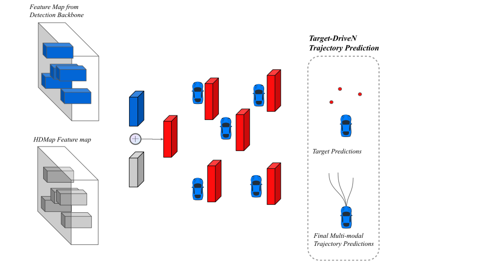

This project was done at research team of perception team at ADAS, Huawei Technologies Co., Ltd.

## Motivation
Although most of the autonomous driving algorithm follows the pipeline of "detection-tracking-prediction", it can be deficient since each stage will accumulate the errors previous stages have made. In some cases, the errors will be amplified and result in disastrous accidents. Moreover, since in later stages, the features that previous stages used to produce the results are not available anymore, which makes correcting erroneous outputs infeasible. Therefore, instead of exploiting rule-based sensor fusion and the sequential pipeline "detection-tracking-prediction", our research team decided to explore Hydranet-like networks that fuse features, detect objects, track objects and predict object trajectory. Specifically, detecting, tracking and predicting are completed with different heads that connected to the same backbone network that fuses features from different sensors. 

To testify the feasibility, we want to verify if it's doable to predict trajectory based on raw point cloud data. And that's how this project came into being.

## Model Structure
### Backbone Structure
We adopt the detection model from detection team. It's a UNet-like model and its detection head resembles CenterPoint. A lot of somplifications have been done to accelerate the model and make it compatible for AI chips on vehicles. One thing worth noting is that, instead of binary voxels, the model divides the space into fixed-size voxels and compute 4 features for each voxel: Max Z, Min Z, Mean Intensity, No. points. 

### TNT
We first crop rasterized HDMap and feature maps from detection backbone, according to the obstacle position. Then we merge the crop from HDMap and the crop from detection backbone feature maps, to generate the feature for each obstacle, which is then feeded into TNT. The 3 stages of TNT remain unchanged. 

### Overall Structure
Here's a figure that illustrates the overall structure of the point cLoud-based TNT.

## Dataset
Since we use point cloud dataset, there's a huge problem. The distribution of trajectories in the dataset is ill-posed. More than 20% of obstacles in the dataset are either going straight or staying still. To tackle this problem, we use 3 tricks:
1. resample the dataset: upsample difficult scenarios and downsample easy ones.
2. use differentiated loss: higher coefficients for difficult scenarios and lower for easy ones.
3. do data augmentation: flip, rotate, etc.

## Demo
I'm very sorry that due to the regulation of Huawei, I cannot show any source code or finished effect of the model. These demo videos are the only things that I can provide here.

<!-- <iframe height=1000 width=1000 src="demo_1.avi">

<iframe height=1000 width=1000 src="demo_2.avi">

<iframe height=1000 width=1000 src="demo_3.avi">

<iframe height=1000 width=1000 src="demo_4.avi"> -->
<video width="1000" height="1000" controls>
  <source src="demo_1.mp4" type="video/mp4">
</video>

<video width="1000" height="1000" controls>
  <source src="demo_2.mp4" type="video/mp4">
</video>

<video width="1000" height="1000" controls>
  <source src="demo_3.mp4" type="video/mp4">
</video>

<video width="1000" height="1000" controls>
  <source src="demo_4.mp4" type="video/mp4">
</video>

## Conclusion
Due to the volumn of point cloud dataset, it contains far less scenarios than ordinary trajectory prediction dataset. However, the performance is considerable as most peaks of multi-modal predictions are correctly assigned. We belive there's still lots of space for improvement, if we use larger dataset and add **interaction module** in the model.